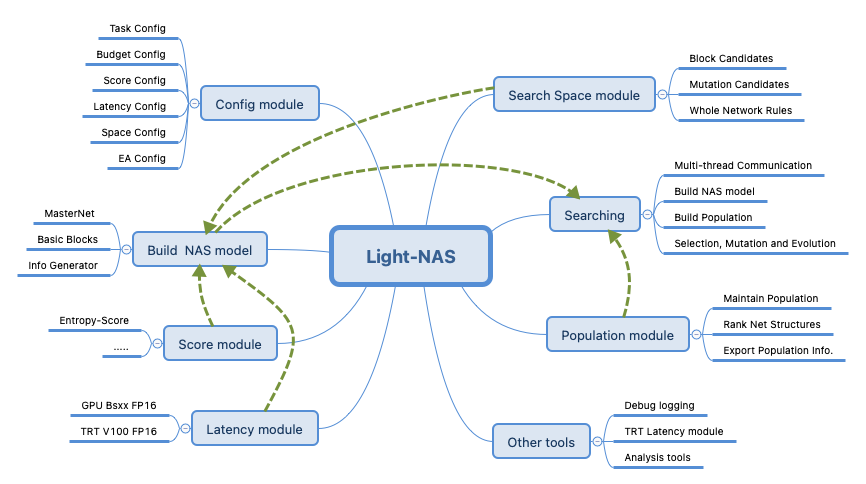

## News

- **:sunny: Hiring research interns for Neural Architecture Search, Tiny Machine Learning, Computer Vision tasks: [xiuyu.sxy@alibaba-inc.com](xiuyu.sxy@alibaba-inc.com)**
- :boom: 2022.11: [**MAE-NAS backbone for DAMO-YOLO**](scripts/damo-yolo/Tutorial_NAS_for_DAMO-YOLO_cn.md) is now supported! The [**DAMO-YOLO**](https://github.com/tinyvision/DAMO-YOLO) paper is on [ArXiv](https://arxiv.org/abs/2211.15444) now.
- :boom: 2022.09: [**Mixed-Precision Quantization**](scripts/quant/README.md) is now supported! The [**QE-Score**](https://openreview.net/pdf?id=E28hy5isRzC) paper is accepted by NeurIPS'22.
- :boom: 2022.06: Code for [**MAE-DET**](scripts/detection/README.md) is now released.
- :boom: 2022.05: [**MAE-DET**](https://proceedings.mlr.press/v162/sun22c/sun22c.pdf) is accepted by ICML'22.
- :boom: 2021.09: Code for [**Zen-NAS**](https://github.com/idstcv/ZenNAS) is now released.
- :boom: 2021.07: The inspiring training-free paper [**Zen-NAS**](https://openaccess.thecvf.com/content/ICCV2021/papers/Lin_Zen-NAS_A_Zero-Shot_NAS_for_High-Performance_Image_Recognition_ICCV_2021_paper.pdf) has been accepted by ICCV'21.

***
## Introduction

English | [简体中文](README_zh-CN.md)

Lightweight Neural Architecture Search (Light-NAS) is an open source zero-short NAS toolbox for backbone search based on PyTorch. The master branch works with **PyTorch 1.4+** and **OpenMPI 4.0+**.

<details open>
<summary>Major features</summary>

* **Modular Design**

    

    **The toolbox consists of different modules (controlled by Config module), incluing [Models Definition module](nas/models/README.md)
, [Score module](nas/scores/README.md), [Search Space module](nas/spaces/README.md), [Latency module](latency/op_profiler/README.md) and [Population module](nas/evolutions/README.md). We use `nas/builder.py` to build nas model, and `nas/search.py` to complete the whole seaching process. Through the combination of these modules, we can complete the backbone search in different tasks (e.g., Classficaiton, Detection) under different budget constraints (i.e., Parameters, FLOPs, Latency).**

* **Supported Tasks**
    
    **For a better start, we provide some examples for different tasks as follow.**

    **`Classification`**: Please Refer to this [Search Space](nas/spaces/space_K1KXK1.py) and [Example Shell](scripts/classification/example_R50_FLOPs.sh).

    **`Detection`**: Please Refer to this [Search Space](nas/spaces/space_K1KXK1.py) and [Example Shell](scripts/detection/example_R50_FLOPs.sh).

    **`Quantization`**: Please Refer to this [Search Space](nas/spaces/space_quant_k1dwk1.py) and [Example Shell](scripts/quant/mixed_19d2G.sh).

</details>

***
## License

This project is developed by Alibaba and licensed under the [Apache 2.0 license](LICENSE).

This product contains third-party components under other open source licenses.

See the [NOTICE](NOTICE) file for more information.

***
## Changelog
**1.0.3** was released in 2022/11/30:

* Support MAE-NAS for [DAMO-YOLO](https://github.com/tinyvision/DAMO-YOLO).
* Add 2 new blocks: k1kx and kxkx.
* Add a [tutorial](scripts/damo-yolo/Tutorial_NAS_for_DAMO-YOLO_cn.md) on *NAS for DAMO-YOLO*.

Please refer to [changelog.md](docs/changelog.md) for details and release history.

***
## Installation

### Prerequisites
* Linux
* GCC 7+
* OpenMPI 4.0+
* Python 3.6+
* PyTorch 1.4+
* CUDA 10.0+

### Prepare environment
1. Compile the OpenMPI 4.0+ [Downloads](https://www.open-mpi.org/software/ompi/v4.0/). 
    ```shell
    cd path
    tar -xzvf openmpi-4.0.1.tar.gz
    cd openmpi-4.0.1
    ./configure --prefix=/your_path/openmpi
    make && make install
    ```
    add the commands into your `~/.bashrc`
    ```shell
    export PATH=/your_path/openmpi/bin:$PATH
    export LD_LIBRARYPATH=/your_path/openmpi/lib:$LD_LIBRARY_PATH
    ```

2. Create a conda virtual environment and activate it.

    ```shell
    conda create -n light-nas python=3.6 -y
    conda activate light-nas
    ```

3. Install torch and torchvision with the following command or [offcial instruction](https://pytorch.org/get-started/locally/).
    ```shell
    pip install torch==1.4.0+cu100 torchvision==0.5.0+cu100 -f https://download.pytorch.org/whl/torch_stable.html
    ```
    if meet `"Not be found for jpeg"`, please install the libjpeg for the system.
    ```shell
    sudo yum install libjpeg # for centos
    sudo apt install libjpeg-dev # for ubuntu
    ```

4. Install other packages with the following command.

    ```shell
    pip install -r requirements.txt
    ```

***
## Easy to use

* **Search with examples**
    
    ```shell
    cd scripts/classification
    sh example_xxxx.sh
    ```

<!-- * **Use searched models in your own training pipeline**

    **copy `nas/models` to your pipeline, then** 
    ```python
    from models import __all_masternet__
    # for classifictaion
    model = __all_masternet__['MasterNet'](num_classes=classes, 
                                structure_txt=structure_txt,
                                out_indices=(4,),
                                classfication=True)

    # for detection backbone
    model = __all_masternet__['MasterNet'](structure_txt=structure_txt,
                                out_indices=(1,2,3,4))

    # if load with pretrained model
    model.init_weights(pretrained=pretrained_pth)
    ``` -->

***
## Results
### Results for Classification, [Details are here](scripts/classification/README.md).

| Backbone  | size   | Param (M) | FLOPs (G) |   Top-1 | Structure | Download |
|:---------:|:-------:|:-------:|:-------:|:-------:|:--------:|:------:|
| R18-like | 224 | 10.8 |    1.7     |   78.44  | [txt](scripts/classification/models/R18-like.txt)       |[model](https://idstcv.oss-cn-zhangjiakou.aliyuncs.com/LightNAS/classfication/R18-like.pth.tar) |
| R50-like | 224 | 21.3 |    3.6     |   80.04  | [txt](scripts/classification/models/R50-like.txt)       |[model](https://idstcv.oss-cn-zhangjiakou.aliyuncs.com/LightNAS/classfication/R50-like.pth.tar) |
| R152-like | 224 | 53.5 |    10.5     |   81.59  | [txt](scripts/classification/models/R152-like.txt)       |[model](https://idstcv.oss-cn-zhangjiakou.aliyuncs.com/LightNAS/classfication/R152-like.pth.tar) |

**Note**:
If you find this useful, please support us by citing it.
```
@inproceedings{zennas,
	title     = {Zen-NAS: A Zero-Shot NAS for High-Performance Deep Image Recognition},
	author    = {Ming Lin and Pichao Wang and Zhenhong Sun and Hesen Chen and Xiuyu Sun and Qi Qian and Hao Li and Rong Jin},
	booktitle = {2021 IEEE/CVF International Conference on Computer Vision},  
	year      = {2021},
}
```
> The official code for **Zen-NAS** was originally released at https://github.com/idstcv/ZenNAS.   <br/>

***
### Results for Object Detection, [Details are here](scripts/detection/README.md).
| Backbone | Param (M) | FLOPs (G) |   box AP<sub>val</sub> |   box AP<sub>S</sub> |   box AP<sub>M</sub>  |   box AP<sub>L</sub> | Structure | Download |
|:---------:|:---------:|:---------:|:-------:|:-------:|:-------:|:-------:|:--------:|:------:|
| ResNet-50 | 23.5 |    83.6    |  44.7 | 29.1 | 48.1 | 56.6  | - | - |
| ResNet-101| 42.4 |    159.5   |  46.3 | 29.9 | 50.1 | 58.7  | - | - |
| MAE-DET-S | 21.2 |    48.7    |  45.1 | 27.9 | 49.1 | 58.0  | [txt](scripts/detection/models/maedet_s.txt)       |[model](https://idstcv.oss-cn-zhangjiakou.aliyuncs.com/LightNAS/detection/maedet-s/latest.pth) |
| MAE-DET-M | 25.8 |    89.9    |  46.9 | 30.1 | 50.9 | 59.9  | [txt](scripts/detection/models/maedet_m.txt)       |[model](https://idstcv.oss-cn-zhangjiakou.aliyuncs.com/LightNAS/detection/maedet-m/latest.pth) |
| MAE-DET-L | 43.9 |    152.9   |  47.8 | 30.3 | 51.9 | 61.1  | [txt](scripts/detection/models/maedet_l.txt)      |[model](https://idstcv.oss-cn-zhangjiakou.aliyuncs.com/LightNAS/detection/maedet-l/latest.pth) |

**Note**:
If you find this useful, please support us by citing it.
```
@inproceedings{maedet,
  title     = {MAE-DET: Revisiting Maximum Entropy Principle in Zero-Shot NAS for Efficient Object Detection},
  author    = {Zhenhong Sun and Ming Lin and Xiuyu Sun and Zhiyu Tan and Hao Li and Rong Jin},
  booktitle = {International Conference on Machine Learning},
  year      = {2022},
}
```

***
### Results for low-precision backbones, [Details are here](scripts/quant/README.md).

|Backbone|Param (MB)|BitOps (G)|ImageNet TOP1|Structure|Download|
|:----|:----|:----|:----|:----|:----|
|MBV2-8bit|3.4|19.2|71.90%| -| -|
|MBV2-4bit|2.3|7|68.90%| -|- |
|Mixed19d2G|3.2|18.8|74.80%|[txt](scripts/quant/models/mixed7d0G.txt) |[model](https://idstcv.oss-cn-zhangjiakou.aliyuncs.com/LightNAS/quant/mixed-7d0G/quant_238_70.7660.pth.tar) |
|Mixed7d0G|2.2|6.9|70.80%|[txt](scripts/quant/models/mixed19d2G.txt) |[model](https://idstcv.oss-cn-zhangjiakou.aliyuncs.com/LightNAS/quant/mixed-19d2G/quant_237_74.8180.pth.tar) |

**Note**:
If you find this useful, please support us by citing it.
```
@inproceedings{qescore,
  title     = {Entropy-Driven Mixed-Precision Quantization for Deep Network Design on IoT Devices},
  author    = {Zhenhong Sun and Ce Ge and Junyan Wang and Ming Lin and Hesen Chen and Hao Li and Xiuyu Sun},
  journal   = {Advances in Neural Information Processing Systems},
  year      = {2022},
}
```

***
## Main Contributors

[Zhenhong Sun](https://sites.google.com/view/sunzhenhong), [Ming Lin](https://minglin-home.github.io), [Xiuyu Sun](https://sites.google.com/view/sunxiuyu), [Hesen Chen](https://scholar.google.com/citations?user=75v6J-cAAAAJ), [Ce Ge](https://scholar.google.com/citations?user=VUOriGkAAAAJ), [Yilun Huang](https://hylcool.github.io/).
